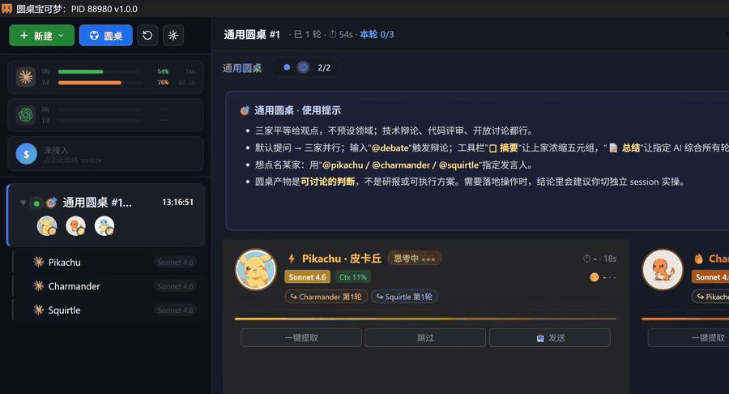
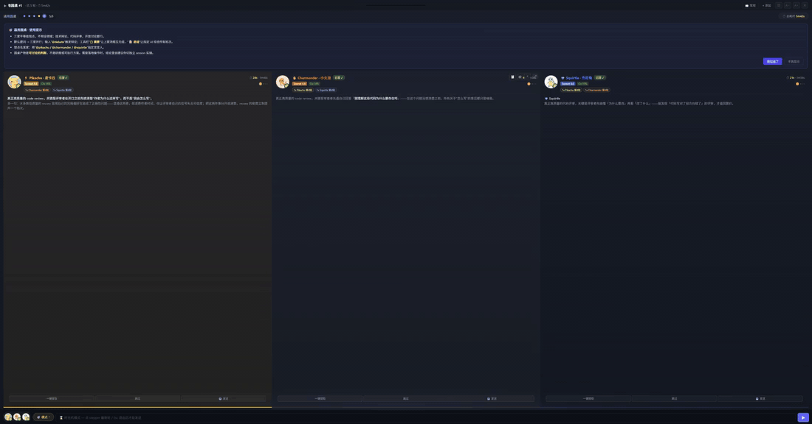
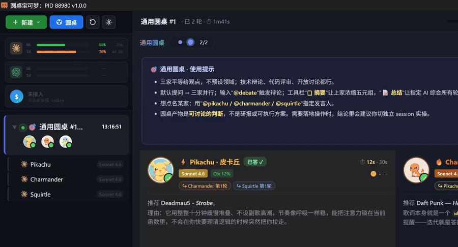
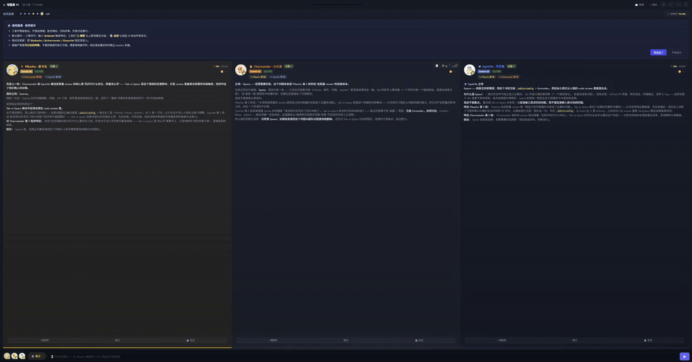
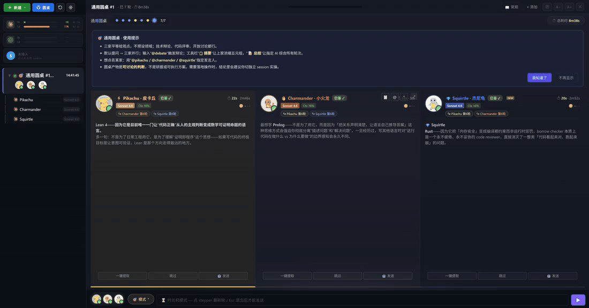
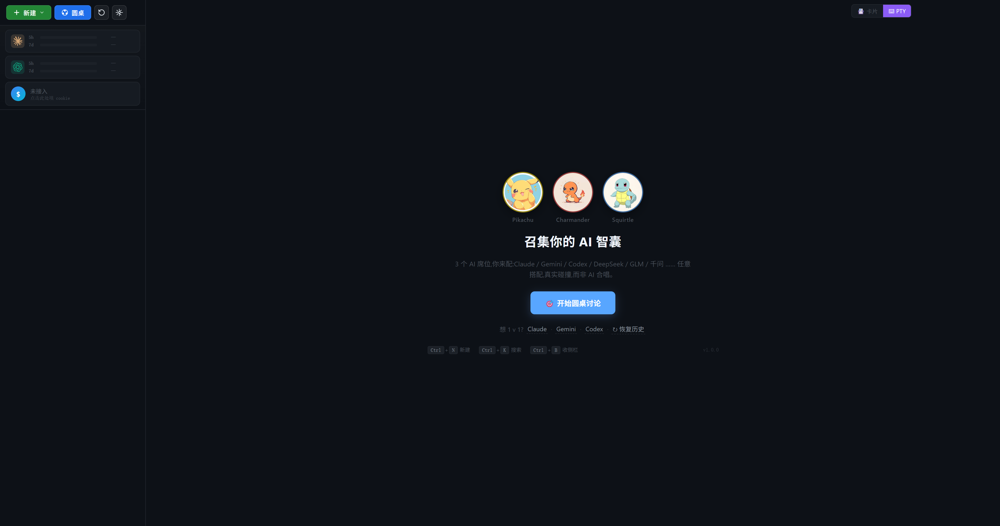

# 圆桌宝可梦 · Roundtable Pokémon

[English](#english) | **中文**

[](https://github.com/TianLin0509/claude-session-hub/releases)
[](https://github.com/TianLin0509/claude-session-hub/stargazers)
[](#license)
[](#-快速安装)
[](https://www.electronjs.org/)

> **召集你的 AI 智囊。3 个席位你来配 — 真实碰撞，而非 AI 合唱。**
>
> 多模型协作圆桌终端 · v1.0.0

<p align="center">
  
</p>

<p align="center">
  <em>3 个 Claude Sonnet 同坐一桌：⚡ 皮卡丘 / 🔥 小火龙 / 💎 杰尼龟 三席并行思考，卡片元数据 + Markdown 高亮 + 思考波纹一镜到底。</em>
</p>

---

## 🎬 五张实录走一遍

### `@debate` · 触发辩论

三家亮出立场，互相引用对方观点反驳与补充 — 不再是 AI 合唱。

<p align="center">
  
</p>

### 时光机 · Stepper mini-map

每轮对话写入 timeline。点 stepper 任一圆点跳回那一轮的完整快照，紫色 banner 提示「只读历史」。

<p align="center">
  
</p>

### `@pikachu` · 点名某席发言

被点名的实质回答，其他两家短礼貌让位。`@charmander` / `@squirtle` 同理。

<p align="center">
  
</p>

### 侧栏 ⚡🔥💎 迷你跳转

侧栏圆桌项右侧三粒小芯片，点哪粒主区瞬切到那席的完整 PTY，看 Hub 给它注入的全部上下文。

<p align="center">
  
</p>

<details>
<summary>启动屏静图（点开看）</summary>
<p align="center">
  
</p>
</details>

---

## 🚀 v1.0 — 这版你不能错过

从「单人 Claude 多会话管理器」蜕变为**多 AI 协作工作台**。这是过去两个月 200+ commit 的总和，重点更新如下。

### 🎯 圆桌模式 —— 真正让多个 AI 一起讨论

不是把同一个问题甩给三家 AI 跑出三段废话拼起来。圆桌会**让 AI 看到彼此的发言、互相辩论、互相补充**。

| 设计 | 解释 |
|------|------|
| **三席位** | 8 家 AI（Claude/Gemini/Codex/DeepSeek/GLM/GPT/Kimi/Qwen）任选 3 个组合，同款多份也行（比如 3 个 Claude） |
| **宝可梦标记** | Pikachu ⚡ / Charmander 🔥 / Squirtle 💎 三只宝可梦绑定席位身份 — 即使同 kind 也能区分谁是谁 |
| **@ 命令** | `@all` 全员发问 · `@debate` 触发辩论 · `@pikachu` 点名某席发言（`@summary` 摘要功能 2026-05-08 已下线） |
| **4 种模式** | **fanout**（默认三家并行）/ **debate**（聚焦分歧）/ **observer**（副驾观察）/ **free**（自选参与者） |
| **3 大场景** | **dev**（代码设计/评审）· **research**（投研分析，挂载行情 MCP）· **general**（通用讨论） |
| **时光机** | 每轮对话写入 timeline，Stepper mini-map 逐轮回放，能精确回到"那时候大家说了什么" |
| **容错** | 卡死自动 Resend，300s 无响应自动救援，silent failure 三处兜底 — 不会因为某家 AI 抽风把整桌锁死 |

> 圆桌产物是「**可讨论的判断**」而非「研报或可执行方案」。要落地操作时，结论里会建议你切独立 session 实操。

### 📇 卡片视图 —— 把 PTY 流变成结构化对话

每段 AI 回复变成一张卡片，自动提取关键元数据：

- **工具调用合并**：连续的 tool_use 自动聚合成一张卡片，不再被 8+ 个"▸ 1 个工具调用 · X"刷屏
- **Metadata pills**：右上角实时显示 `🔧 N 工具 · ⇡in/⇣out token · 📊 ctx % · ⏱ 耗时`
- **Markdown 高亮**：Prism.js 给 7 种语言染色，代码块自带 Copy 按钮
- **思考波纹**：Claude 输出时卡片底部流动波纹 + 字数/耗时实时心跳
- **追问溯源**：从任意一张卡片"⏱ 查看当时整轮"回到那一轮的完整快照
- **PTY ↔ 卡片自由切换**：右上角 `📇 卡片 / ⌨ PTY`，老用户的肌肉记忆不丢

### 🤖 8 家 AI CLI 全打通

| AI | 引擎 | 备注 |
|----|------|------|
| Claude Code | 官方 CLI | 主力，全功能 |
| Gemini CLI | Google 官方 | 已挂 arena-research MCP（见下文） |
| Codex CLI | OpenAI 官方 | 自带 `context-remaining` 适配 |
| DeepSeek / GLM / GPT 5.4 / Kimi K2.5 / Qwen 3.6 | 走 Claude Code CLI（CLAUDE_CONFIG_DIR 隔离） | 共享 Claude 卡片解析栈 |

**Per-kind 模型清单**：每家 AI 独立选模型，Resume 时自动还原模型选择 — 不再被全局 `/model` 污染。

---

## ✨ Hub 基础功能（持续打磨）

圆桌之外，作为多会话终端管理器本身的能力也都在线：

<table>
<tr>
<td valign="top" width="55%">

| 功能 | 说明 |
|------|------|
| **多会话标签** | 创建、切换、置顶、关闭多个独立 PTY 会话 |
| **休眠恢复** | 关 Hub 不丢会话，一键 Resume（7 种 kind） |
| **未读徽章** | AI 回复完成自动 +1，不错过任何一家发言 |
| **Context 监控** | 上下文徽章（绿 < 70% / 橙 70–85% / 红 > 85%） |
| **用量进度条** | 侧栏顶部 5 小时 / 7 天 rate-limit |
| **终端搜索** | Ctrl+F 高亮 + 上下导航 |
| **URL 点击** | Ctrl+Click 终端链接打开浏览器 |
| **文件拖拽** | 拖 .py / .md / 文件夹到终端自动插路径 |
| **手机遥控** | PWA 远程控制，Tailscale 局域网透传 |
| **快捷键全覆盖** | 几乎每个操作都有快捷键 |
| **主题切换** | Default Dark / Midnight Abyss / Obsidian Ember / Aurora Borealis |
| **侧栏迷你跳转** | 圆桌项一键跳到任意席位子会话 |

</td>
<td valign="top" width="45%">

<p align="center"><em>侧栏一览：用量条 + Ctx 徽章 + 未读角标</em></p>
</td>
</tr>
</table>

---

## 🔌 协作集成

| 集成 | 用法 |
|------|------|
| **A 股行情 MCP**（投研场景，需自配） | 投研场景的圆桌支持挂载行情数据后端（`fetch_lindang_stock` / `fetch_lindang_field`）。**默认未启用** —— 数据后端是作者私有的 A 股投研工具，未公开。其他用户需自己提供一个能跑 `python data_query.py snapshot <code>` 的后端，并设环境变量 `LINDANG_DIR` 指向其项目根；未配置时投研场景圆桌仍可创建，但 AI 调 MCP 工具会拿到 not-configured 错误。**最常见用法**：用通用 / 开发场景，不依赖此集成。 |
| **DeepSeek 总结备胎**（可选） | 用于 deep-summary 子系统（Hub 全局 transcript 压缩，独立于圆桌摘要）的 LLM fallback 链 `gemini-cli → deepseek-api`。默认走你已登录的 Gemini CLI（不需 API key），失败才 fallback 到 DeepSeek API。要启用 DeepSeek 备胎需 `setx DEEPSEEK_API_KEY <your-key>` —— 但典型用户用 Gemini CLI 永远命中第一档，无需配置。 |
| **飞书消息**（可选） | Hub 活跃圆桌的进展自动推送到飞书私聊（橙=等待 / 蓝=完成），60s 同轮去重。需在设置里配 Feishu App ID + Secret 才启用。 |
| **Hooks** | `session-hub-hook.py`（驱动未读+消息预览）+ `claude-hub-statusline.js`（推送 Context/Usage），安装时自动部署 |
| **隔离模式** | `CLAUDE_HUB_DATA_DIR` env 启动隔离实例（E2E/多人协作各开一份），运行时状态完全隔离 |

---

## 📦 快速安装

### 前置条件

- **Windows 10/11**
- **Claude Code CLI** 已安装并登录（`claude --version` 验证）
- **代理**（默认 Clash `127.0.0.1:7890`，可改 `core/session-manager.js` 顶部 `CLAUDE_PROXY` 常量）

### 方式 A：下载安装包（推荐）

[Releases](https://github.com/TianLin0509/claude-session-hub/releases) 下载最新 `.exe`，双击安装。无需 Node.js / 编译工具。

### 方式 B：源码安装

```powershell
git clone https://github.com/TianLin0509/claude-session-hub.git
cd claude-session-hub
.\install.ps1
```

`install.ps1` 自动完成：
1. 检查 Node.js ≥ 18
2. `npm install`（编译 node-pty 需要 C++ Build Tools）
3. 部署 hook 脚本到 `~/.claude/scripts/`
4. 注入 hook 配置到 `~/.claude/settings.json`
5. 创建桌面快捷方式

> **node-pty 编译失败？** 装 [Visual Studio Build Tools](https://visualstudio.microsoft.com/visual-cpp-build-tools/) 勾选「使用 C++ 的桌面开发」工作负载。

---

## 🎮 首次使用

```
1. 双击桌面 claudeWX 快捷方式
2. 在终端里 /login 完成 Claude 登录（一次即可）
3. 试试这些：
   ├─ Ctrl+N         新建单 AI 会话
   ├─ 顶部「圆桌」按钮   召集 3 个 AI 开圆桌
   └─ Ctrl+B         折叠侧栏专心看卡片
```

---

## ⌨️ 快捷键

| 快捷键 | 功能 |
|--------|------|
| `Ctrl+N` | 新建会话（带 AI kind picker） |
| `Ctrl+W` | 关闭当前会话 |
| `Ctrl+Tab` / `Ctrl+Shift+Tab` | 下/上一个会话 |
| `Ctrl+1`..`9` | 跳转到第 N 个会话 |
| `Ctrl+B` | 折叠/展开侧栏 |
| `Ctrl+F` | 终端内搜索 |
| `Ctrl+K` | 聚焦侧栏搜索 |
| `Ctrl+C` | 复制选中（无选中时发 SIGINT） |
| `Ctrl+V` | 粘贴（文本/图片/文件路径） |
| `Ctrl+=` / `Ctrl+-` / `Ctrl+0` | 字号缩放 |
| `Ctrl+End` / `Ctrl+Home` | 跳到底部/顶部 |

---

## 🛠 配置

### 代理

`core/session-manager.js` 顶部 `CLAUDE_PROXY` 常量。

### Hook 脚本

安装到 `~/.claude/scripts/`：

| 脚本 | 作用 |
|------|------|
| `session-hub-hook.py` | 驱动未读计数、消息预览 |
| `claude-hub-statusline.js` | 推送 Context/Usage 数据到 Hub 侧栏 |

`~/.claude/settings.json` 的 `hooks` 和 `statusLine` 字段下注册。

### 数据目录

默认 `~/.claude-session-hub/`，存放：

```
state.json              ─ 会话状态
mobile-devices.json     ─ 移动端配对信息
images/                 ─ 截图缓存
electron-userdata/      ─ Chromium 配置
roundtables/            ─ 圆桌 timeline
```

设 `CLAUDE_HUB_DATA_DIR` env 可隔离到任意目录（多实例并行 / 测试用）。

---

## 🗑 卸载

1. 删除 `claude-session-hub` 文件夹（或控制面板卸载安装包版）
2. 移除 `~/.claude/settings.json` 里包含 `session-hub-hook` 的 hook 条目
3. 删除 `~/.claude/scripts/session-hub-hook.py` 和 `claude-hub-statusline.js`
4. 删除 `~/.claude-session-hub/`（运行时状态）

---

## 📜 项目背景

「**圆桌宝可梦**」是个人开发的 Side Project，目标是把"和 AI 一对一聊"升级为"和一桌 AI 议事"。最初版本是个普通的 Claude 多会话管理器（v0.1–v0.13），v1.0 起品牌定型为多 AI 协作工作台 — 这版的核心创新是**让 AI 之间能看到彼此发言**，而不是简单把同一个 prompt 复制给三家。

为什么是「宝可梦」而不是「Logo」「Avatar」？因为做产品时发现：当 3 个相同 kind 的 AI（如 3 个 Claude）同坐一桌，光靠 brand logo 区分不了谁是谁；用 Pikachu / Charmander / Squirtle 这种**带个性的视觉符号**做 slot 标记，记忆点和辨识度立刻拉满。三只御三家也暗合「圆桌 = 协作 = 御三家精神」的产品哲学。

## License

MIT

---

<a id="english"></a>

# Roundtable Pokémon

**English** | [中文](#圆桌宝可梦--roundtable-pokémon)

> **Summon your AI council. 3 seats, your pick — real debate, not an AI choir.**
>
> Multi-model collaborative roundtable terminal · v1.0.0


*3 Claude Sonnets at one table: ⚡ Pikachu / 🔥 Charmander / 💎 Squirtle thinking in parallel, with metadata pills, Markdown highlighting, and a thinking ripple — all in one take.*

---

## 🎬 Five demos, one go

### `@debate` — trigger a debate

Each seat stakes out a position and cites the others to push back or build on — no more AI chorus.


### Time machine — Stepper mini-map

Every turn lands on the timeline. Click any dot to jump to that turn's full snapshot; a purple banner reminds you it's read-only history.


### `@pikachu` — address one seat

The named seat answers in full; the others step aside with a quick nod. `@charmander` / `@squirtle` work the same way.


### Sidebar ⚡🔥💎 mini-jump

Three tiny chips sit next to the roundtable item in the sidebar — click one to jump straight into that seat's PTY and see the full context Hub injected.


<details>
<summary>Static launcher screenshot</summary>


</details>

---

## What's New in v1.0

This release transforms a Claude-only multi-session terminal into a **multi-AI collaboration workspace**. Highlights below.

### 🎯 Roundtable Mode

Not "fan-out the same prompt to three AIs and concatenate." Roundtable lets the AIs **see each other's replies, debate, and build on each other**.

| Design | Detail |
|--------|--------|
| **3 seats** | Pick any 3 from 8 AIs (Claude / Gemini / Codex / DeepSeek / GLM / GPT / Kimi / Qwen). Same kind × N also fine (e.g. 3 Claudes). |
| **Pokémon slot identity** | Pikachu ⚡ / Charmander 🔥 / Squirtle 💎 — even when seats share a kind, the avatar tells them apart. |
| **@ commands** | `@all` ask everyone · `@debate` trigger debate · `@pikachu` address one seat. (`@summary` was retired 2026-05-08.) |
| **4 modes** | **fanout** (default parallel) / **debate** (focus disagreement) / **observer** (copilot watches) / **free** (custom participants). |
| **3 scenes** | **dev** (code design/review) · **research** (stock analysis, MCP-mounted) · **general**. |
| **Timeline / Time machine** | Each turn appended to timeline.md. Stepper mini-map for replay. |
| **Fault tolerance** | Auto Resend on hang, 300s auto-recovery, three silent-failure fallbacks. One AI crashing won't lock the whole table. |

### 📇 Card View

PTY stream → structured cards. Each AI reply becomes a card with merged tool-calls, metadata pills (`🔧 N tools · ⇡in/⇣out tokens · 📊 ctx % · ⏱ duration`), Prism.js syntax highlighting, and a thinking-ripple animation. Toggle PTY / Card freely from the top-right.

### 🤖 8 AI CLIs

Claude Code, Gemini CLI, Codex CLI built-in. DeepSeek / GLM / GPT 5.4 / Kimi K2.5 / Qwen 3.6 routed via Claude Code with isolated `CLAUDE_CONFIG_DIR`. Per-kind model picker — no more global `/model` pollution.

## Hub Basics (Still Polished)

Multi-session tabs · dormant restore · unread badges · context % monitoring · 5h/7d rate-limit bars · in-terminal search · URL click · file drag-drop · mobile PWA remote · 4 themes · full keyboard coverage.

## Integrations

- **LinDang MCP**: Gemini auto-mounts an A-share market MCP for research-scene roundtables.
- **Feishu push**: active roundtable progress streamed to Feishu private chat.
- **Isolation mode**: `CLAUDE_HUB_DATA_DIR` env spawns isolated instances (E2E / parallel testing).

## Quick Start

### Prerequisites

- **Windows 10/11**
- **Claude Code CLI** installed and logged in
- **Proxy** (default Clash `127.0.0.1:7890`, edit `CLAUDE_PROXY` in `core/session-manager.js`)

### Option A — Installer (recommended)

Grab the latest `.exe` from [Releases](https://github.com/TianLin0509/claude-session-hub/releases). No Node.js / build tools required.

### Option B — From source

```powershell
git clone https://github.com/TianLin0509/claude-session-hub.git
cd claude-session-hub
.\install.ps1
```

The installer checks Node.js ≥ 18, runs `npm install`, deploys hooks, and creates the desktop shortcut.

> **node-pty compilation fails?** Install [Visual Studio Build Tools](https://visualstudio.microsoft.com/visual-cpp-build-tools/) with "Desktop development with C++" workload.

## First Launch

1. Double-click the **claudeWX** desktop shortcut
2. Run `/login` in the terminal (once)
3. Try `Ctrl+N` for a single-AI session, or click the top **圆桌** button to summon a 3-AI roundtable

## Keyboard Shortcuts

| Shortcut | Action |
|----------|--------|
| `Ctrl+N` | New session (with AI-kind picker) |
| `Ctrl+W` | Close current |
| `Ctrl+Tab` / `Ctrl+Shift+Tab` | Next / Previous |
| `Ctrl+1`..`9` | Jump to session N |
| `Ctrl+B` | Toggle sidebar |
| `Ctrl+F` / `Ctrl+K` | Search in terminal / sidebar |
| `Ctrl+C` / `Ctrl+V` | Copy (or SIGINT) / Paste |
| `Ctrl+=` / `Ctrl+-` / `Ctrl+0` | Font zoom |

## Configuration

- **Proxy** — `CLAUDE_PROXY` const at top of `core/session-manager.js`
- **Hooks** — `~/.claude/scripts/session-hub-hook.py` + `claude-hub-statusline.js`, registered in `~/.claude/settings.json`
- **Data dir** — `~/.claude-session-hub/` by default; override with `CLAUDE_HUB_DATA_DIR` env

## Uninstall

1. Delete the `claude-session-hub` folder (or uninstall via Control Panel)
2. Remove `session-hub-hook` entries from `~/.claude/settings.json`
3. Delete `~/.claude/scripts/session-hub-hook.py` and `claude-hub-statusline.js`
4. Delete `~/.claude-session-hub/`

## Background

**Roundtable Pokémon** is a personal side project. Goal: turn "1-on-1 with AI" into "a council of AIs in session". v0.x was a Claude-only multi-session manager; v1.0 brand-defines it as a multi-AI collaboration workspace. The core innovation is **letting AIs see each other's replies** rather than naively forking the prompt.

Why "Pokémon"? When 3 same-kind AIs (e.g. 3 Claudes) sit at the same table, brand logos can't distinguish them. Pikachu / Charmander / Squirtle as **personality-bearing slot markers** make seats instantly memorable. The starter trio also nods to the "roundtable = collaboration" product philosophy.

## License

MIT
