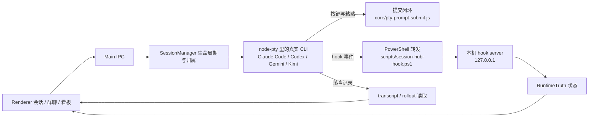

# 架构与复用地图

结论：AI Hub 让官方 CLI 在真实终端（PTY）里原样运行，Hub 自己不模拟 CLI；运行状态以 CLI 的 hook 回报为准，卡片内容读 CLI 自己落盘的记录。适合借鉴的是这条「CLI 原样运行 → hook 报状态 → 落盘记录出卡片」的链路。桌面 Hub 是单用户本机程序，不是可以直接多租户部署的后端。

| 要借鉴什么 | 起点 | 必须一起理解的边界 |
|---|---|---|
| 启动与数据隔离 | main-bootstrap.js、core/data-dir.js | Chromium profile 与 Hub 数据同时分开 |
| 会话生命周期 | core/session-manager.js | 会话身份在启动前用 `--session-id` 确定，不按目录和时间猜 |
| 状态回报 | core/claude-hook-integration.js、core/codex-hook-integration.js、core/hook-runner.js、core/hook-payload.js | hook 是完成的权威信号；屏幕文字只能推断「运行中 / 等待」 |
| 消息提交 | main/ipc/prompt-submit-handlers.js、core/pty-prompt-submit.js | 分块投喂 → 等折叠标记 → 等语义确认 → 缺确认才补一次回车；拿不到确认如实显示「补发」 |
| 卡片内容 | core/claude-disk-transcript.js | 读 CLI 自己的落盘记录，不解析终端画面 |
| 群聊编排 | core/group-chat-orchestrator.js、main/groupchat/dispatcher.js | 发言顺序、停止、错误传播和成员身份 |
| 开发协作 | core/dev-file-workflow.js、renderer/ran.js | 文件交付、作者/合并角色和项目自身规则 |
| 工作区 | core/workspace-service.js | 不把组织根当任务目录、不扫描整盘 |
| 账号中心 | core/account-center.js、core/account-adapters.js | 检测、打开授权、确认授权是不同状态 |
| 记忆 | core/hub-memory-service.js、renderer/memory-panel.js | 磁盘存在、已发送、正文已读取不能混称 |
| 发行版开关 | core/distribution.js、community-edition.json | 只认发行标记文件，配置和环境变量都改不了 |
| 安装诊断 | core/community-setup.js、scripts/doctor.js | 已安装不等于已登录，错误不吞掉 |

原生结构化后端（Codex App Server、Claude stream-json）仍保留为回退路径：设置 `CLAUDE_HUB_AGENT_RUNTIME=native` 才会启用，界面不暴露。

## 推荐移植顺序

1. 先跑 `npm test` 与 `node tests/e2e-community-cdp.js`，理解 PTY、hook 和持久化路径。
2. 为你们的 agent 接入时，优先让它自己的 CLI 在 PTY 里运行，并提供「开始 / 完成 / 需要审批」这类 hook 或事件；没有这些信号时，Hub 只能显示未知，不能靠终端文字判定完成。
3. 用模拟 CLI 覆盖完成、失败、断连、停止和重启；再用你们自己的测试账号做真实网络验收。
4. UI 可以替换，状态不能改成依据终端文字猜测。

代价和边界：这套源码保留了成熟桌面 Hub 的大量模块，体积比空白脚手架大，部分历史兼容代码仍在。若要做成公司多用户平台，需要另行设计身份认证、租户数据隔离、远程执行环境、密钥管理与审计，不能把本机 hook 端口直接开放出去。

## 参考

- [AionUi](https://github.com/iOfficeAI/AionUi)：可借鉴安装引导、内置 agent 与外部 CLI 接入的分层。本仓库没有复制其源代码。
